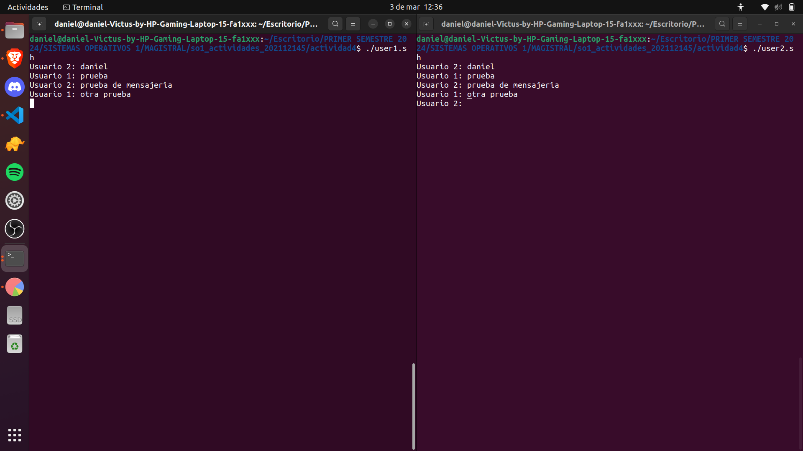

## Universidad de San Carlos de Guatemala

## Sistemas Operativos 1

### Daniel Estuardo Cuque Ruíz

### 202112145

1. Crear el archivo user1.sh

```
#!/bin/bash

# Definir las direcciones de los named pipes
PIPE_FROM_PARTICIPANT1="participant2_to_participant1"
PIPE_TO_PARTICIPANT1="participant1_to_participant2"

# Crear los named pipes si no existen
if [ ! -p "$PIPE_FROM_PARTICIPANT1" ]; then
    mkfifo "$PIPE_FROM_PARTICIPANT1"
fi

if [ ! -p "$PIPE_TO_PARTICIPANT1" ]; then
    mkfifo "$PIPE_TO_PARTICIPANT1"
fi

# Loop para recibir y enviar mensajes
while true; do
    # Recibir mensaje del participante 2
    read message < "$PIPE_FROM_PARTICIPANT1"
    echo "Usuario 2: $message"

    # Solicitar mensaje y enviar al participante 2
    read -p "Usuario 1: " message
    echo "Usuario 1: $message" > "$PIPE_TO_PARTICIPANT1"
done
```


2. Crear el archivo user2.sh

```
#!/bin/bash

# Definir las direcciones de los named pipes
PIPE_FROM_PARTICIPANT2="participant1_to_participant2"
PIPE_TO_PARTICIPANT2="participant2_to_participant1"

# Crear los named pipes si no existen
if [ ! -p "$PIPE_FROM_PARTICIPANT2" ]; then
    mkfifo "$PIPE_FROM_PARTICIPANT2"
fi

if [ ! -p "$PIPE_TO_PARTICIPANT2" ]; then
    mkfifo "$PIPE_TO_PARTICIPANT2"
fi

# Loop para recibir y enviar mensajes
while true; do
    # Solicitar mensaje y enviar al participante 1
    read -p "Usuario 2: " message
    echo "$message" > "$PIPE_TO_PARTICIPANT2"

    # Recibir mensaje del participante 1
    read message < "$PIPE_FROM_PARTICIPANT2"
    echo "$message"
done
```

3. Otorgar permisos para ejecutar los archivos 

```bash
chmod +x user1.sh user2.sh
```

4. Ejecutar archivos en terminales distinas

```bash
./user.sh
```

5. Chatear

